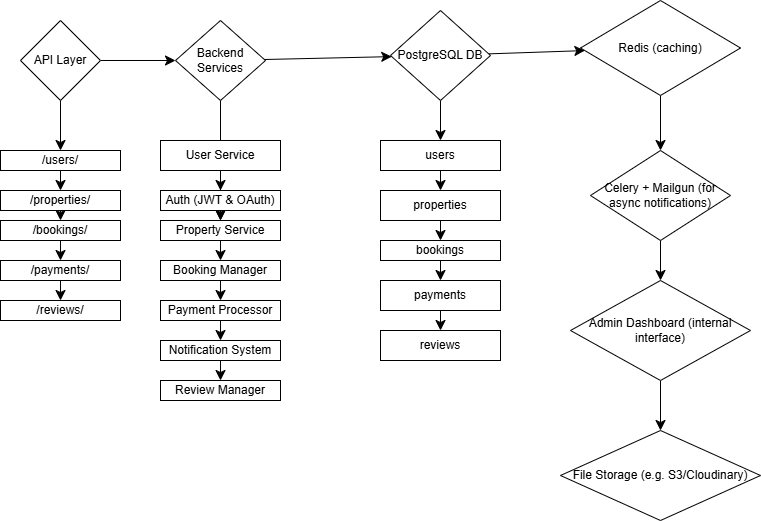

# Airbnb Clone Backend - Features & Functionalities

This document outlines the backend system's core features, architecture, and technical requirements for building the Airbnb Clone.

## 🔑 Core Functionalities

### 1. User Management
- Register as guest or host
- Secure login via email/password or OAuth (Google, Facebook)
- Profile management (contact info, preferences, photos)

### 2. Property Listings
- Add/edit/delete listings (title, location, price, amenities, availability)

### 3. Search and Filtering
- Search listings by location, price, guests, amenities
- Pagination for large result sets

### 4. Booking Management
- Book properties with date validation to prevent double bookings
- Cancel bookings (guest/host)
- Track booking status: pending, confirmed, cancelled, completed

### 5. Payments
- Integrate secure payment gateways (Stripe, PayPal)
- Handle guest payments and host payouts
- Support multiple currencies

### 6. Reviews and Ratings
- Guests leave reviews for properties
- Hosts respond to reviews
- Reviews linked to specific bookings

### 7. Notifications
- Email/in-app notifications for booking, cancellation, and payments

### 8. Admin Dashboard
- Manage users, bookings, listings, and payments

---

## 🛠️ Technical Requirements

### ✅ Database
- Relational DB (PostgreSQL or MySQL)
- Tables:
  - Users
  - Properties
  - Bookings
  - Reviews
  - Payments

### ✅ API
- RESTful API (CRUD operations with proper HTTP methods and status codes)
- Optional: GraphQL for complex queries

### ✅ Auth & Roles
- JWT for authentication
- RBAC: Guest / Host / Admin

### ✅ File Storage
- Store profile & property images (e.g., AWS S3 or Cloudinary)

### ✅ Third-Party Integrations
- Email: SendGrid / Mailgun

### ✅ Error Handling & Logging
- Global error management
- Logging for debugging and monitoring

---

## 🚀 Non-Functional Requirements

- **Scalability**: Modular code + horizontal scaling via load balancers
- **Security**: Data encryption, firewalls, rate limiting
- **Performance**: Redis caching, optimized DB queries
- **Testing**: Unit, integration, and automated API tests (e.g., pytest)

---

## 🖼 System Diagram

