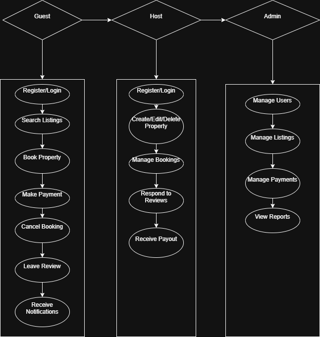

# Airbnb Clone – Use Case Diagram

This diagram illustrates how different actors interact with the Airbnb Clone backend system.

## 👥 Actors

- **Guest**: Can register, search for listings, book properties, make payments, and leave reviews.
- **Host**: Can register, create/manage property listings, handle bookings, and respond to reviews.
- **Admin**: Manages all users, listings, and payments through the admin dashboard.

## 📌 Key Use Cases

- User Registration and Login
- Property Listing Management
- Search and Filtering
- Booking and Payment Processing
- Reviews and Ratings
- Notification System
- Admin Controls for monitoring and oversight

## 🖼 Diagram

